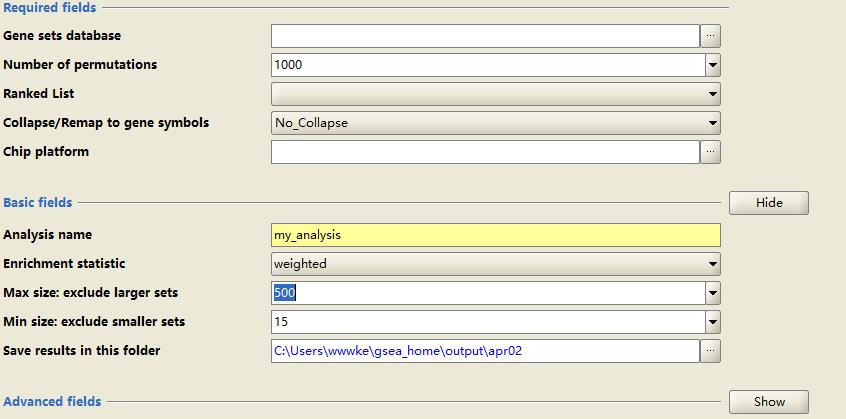
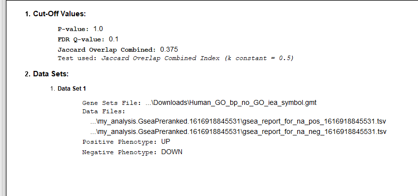
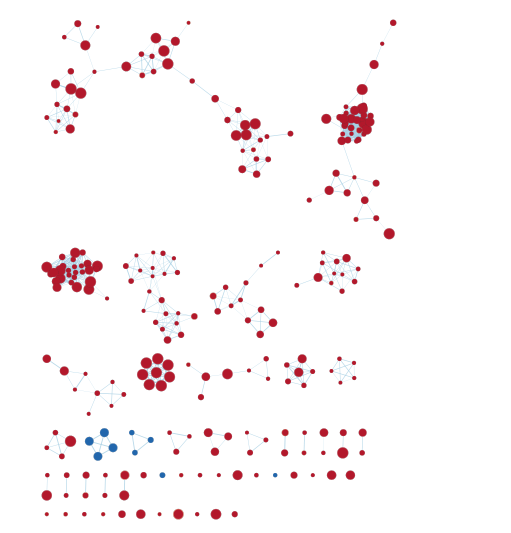
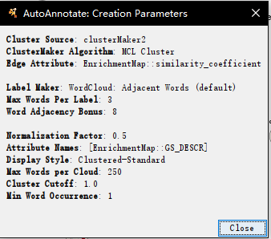
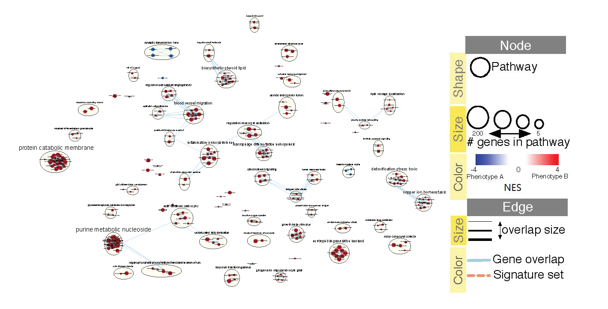
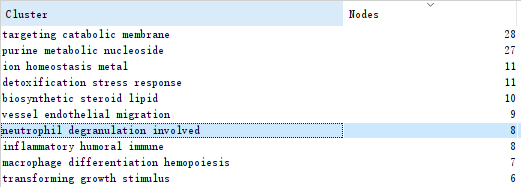
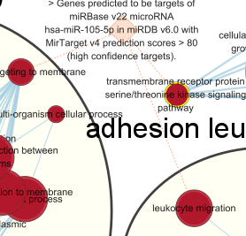

```{r test-main, child = 'a2.Rmd'}
```


# Non-thresholded Gene set Enrichment Analysis
Conduct non-thresholded gene set enrichment analysis using the ranked set of genes from Assignment #2.
## What method did you use? What genesets did you use? Make sure to specify versions and cite your methods.





I used log odd values (B) to generate rank scores in the ranked list. The convertion of ensemble name to protein symble can be seen in my journal. The gene sets database used is Human_GO_bp_no_GO_iea_symbol.gmt from march 1st , baderlab website.
The version of GSEA is GSEA V4.1.0. 

## Summarize your enrichment results.

Enrichment in phenotype: Young

    3247 / 4136 gene sets are upregulated in phenotype na_pos
    748 gene sets are significant at FDR < 25%
    291 gene sets are significantly enriched at nominal pvalue < 1%
    669 gene sets are significantly enriched at nominal pvalue < 5%

Enrichment in phenotype: Old

    889 / 4136 gene sets are upregulated in phenotype na_neg
    32 gene sets are significantly enriched at FDR < 25%
    35 gene sets are significantly enriched at nominal pvalue < 1%
    78 gene sets are significantly enriched at nominal pvalue < 5%


the top gene for the young is  which encode for ribosomal protein L19. the top gene for the old is APOE which is gene associated with Alzheimer disease 2.

## How do these results compare to the results from the thresholded analysis in Assignment #2. Compare qualitatively. Is this a straight forward comparison? Why or why not?

I think the unthreshold method provides more accurate results compare to threshold method. In the threshold method, there is no downstream pathways (na_neg). In the non-threshold pathway, 889 gene sets are in downstream pathway. However, g::profiler is easier to use because it do not require specific rank file and ensembl gene id is acceptable which is a nice feature. The comparsion may not be stright forward because the probes without protein symbles but have ensembl ids are removed in GSEA. 


# Visualize Gene set Enrichment Analysis in Cytoscape
Using your results from your non-thresholded gene set enrichment analysis visualize your results in Cytoscape.

Create an enrichment map - how many nodes and how many edges in the resulting map? 

In the Network panel, it shows that there are 256 nodes and 938 edges.


What thresholds were used to create this map? Make sure to record all thresholds.

I used Q-value = 0.1 and edge cutoff 0.375






Include a screenshot of your network prior to manual layout.

Annotate your network - what parameters did you use to annotate the network. If you are using the default parameters make sure to list them as well.






Make a publication ready figure - include this figure with proper legends in your notebook.




Collapse your network to a theme network. What are the major themes present in this analysis? Do they fit with the model? Are there any novel pathways or themes?
Present your results with the use of tables and screenshots. All figures should have appropriate figure legends.

The major themes presents in this analysis are metabolism such as purine metabolic nucleoside and catabolic membrane. They fit with the model because REST involves in ribosomal metabolism. The major target of the model is this protein and other proteins should be relatived to metabolism. neutophil degranulation involvation is a new pathway because immune system is not the focus of this model but it is interesting to have it with 8 nodes involved


# Interpretation and detailed view of results
The most important aspect of the analysis is relating your results back to the initial data and question.

### Do the enrichment results support conclusions or mechanism discussed in the original paper? How do these results differ from the results you got from Assignment #2 thresholded methods

The enrichment results support the conclusions in the original paper. The enrichment results provides  genes can be found either in young or old. For instance the APOE is the gene relative to Alzheimer's disease. The threshold enrichment analysis didn't provide any information about this gene. The unthreshold enrichment results are more supportive. 


### Can you find evidence, i.e. publications, to support some of the results that you see. How does this evidence support your result?

The Alzheimer's disease (AD) relative genes are found in the results because the paper is discuss the age relative to AD. [@Lu2014] Some samples are collected from AD patients so analysising APOE is reasonable. The top gene for young is L19 which is the topic of the original paper. L19 is a ribosomal gene. The paper wanted to analysis the relationship between REST and age. REST is RE1-silencing transcription factor so that high ribosomal gene expression in young is exactly what the authors want. Further paper shows the relationship between REST and ribosomal biogenesis and explains the expression of L19 in young people. [@Mukherjee2016] 


### Add a post analysis to your main network using specific transcription factors, microRNAs or drugs. Include the reason why you chose the specific miRs, TFs or drugs (i.e publications indicating that they might be related to your model). What does this post analysis show?




I tried to used gmt files from drugbank and uniport to analysis my network but no relative nodes found. Instead, I search in the Molecular Signatures Database (MSigDB) to find gmt file relative to my target protein REST.[@Subramanian15545] miR, MIR105_5P, is found to be relavant to the Rest protein so I did a post analysis by using the add signature gene sets button in EnrichmentMap. The orange node is the miR. The miR is relatived to leokocyte migration, transmembrane recetpor serine kinase pathway and protein targeting to membrane. The result is quite interesting because REST should target ribosomal gene but its relavant miR is targeting transmembrane proteins and leukocyte. REST is only the potential target for the miR by prediction of existing miR available. [@predict] Because MIR105_5P can inducue vascular permeability and increase cancer cell metabolism. [@mir] MIR105_5P may also increase the metabolism of neural cells and inhibit the REST effect on ribosomal proteins. Although MIR105_5P is mainly used by cancer, normal human cells may used it to promote metastasis which is decrease with age. 

# References
