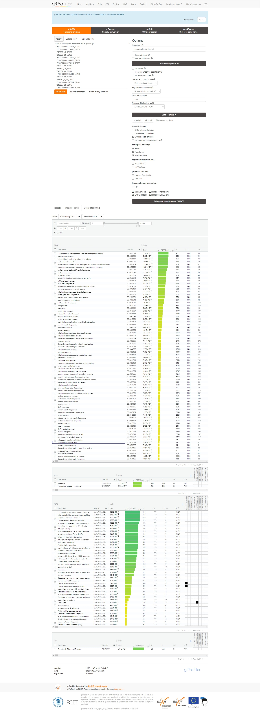

```{r setup, echo=FALSE, message=FALSE}
if (!requireNamespace("BiocManager", quietly = TRUE))    
  install.packages("BiocManager")
if (!requireNamespace("limma", quietly = TRUE))    
  BiocManager::install("limma")
if (!requireNamespace("biomaRt", quietly = TRUE))
  BiocManager::install("biomaRt")
if (!requireNamespace("ComplexHeatmap", quietly = TRUE))
  BiocManager::install("ComplexHeatmap")
if (!requireNamespace("ggplot2", quietly = TRUE))
  install.packages("ggplot2")
if (!requireNamespace("GEOquery", quietly = TRUE))    
  BiocManager::install("GEOquery")
if (!requireNamespace("affy", quietly = TRUE))    
  BiocManager::install("affy")
if (!requireNamespace("arrayQualityMetrics", quietly = TRUE))
  BiocManager::install("arrayQualityMetrics")
if (!requireNamespace("ComplexHeatmap", quietly = TRUE))
  BiocManager::install("ComplexHeatmap")
```

# Introduction

## Preperations

```{r loading, warning=FALSE, message=FALSE }
if (file_test('-f','./eset.RDS')){
library(Biobase)
eset <- readRDS('./eset.RDS')
neweseetMas5  <- readRDS('./neweseetMas5.RDS')


  } else {
  if(!file.exists('GSE53890/CEL')){
  sfiles = GEOquery::getGEOSuppFiles('GSE53890') 
  untar("GSE53890/GSE53890_RAW.tar", exdir = "GSE53890/CEL")
}
# list cell files in CEL dict
f <- list.files("GSE53890/CEL",full.names = TRUE)
library(affy)   # Affymetrix pre-processing
library(limma)
#read Cel files into AffyBatch and convert AffyBatch into ExpressionSet
#remove group number 27 as outlier
newf <- f[-27]
newAffyData = ReadAffy(filenames = newf)
eset <- rma(newAffyData)
neweseetMas5 = mas5(newAffyData)
require("biomaRt")
mart <- useMart("ENSEMBL_MART_ENSEMBL")
mart <- useDataset("hsapiens_gene_ensembl", mart)
annotLookup <- biomaRt::getBM(
  mart = mart,
  attributes = c(
    "affy_hg_u133_plus_2",
    "ensembl_gene_id"),
  filter = "affy_hg_u133_plus_2",
  values = rownames(exprs(eset)),
  uniqueRows=TRUE)
rowname<-rownames(Biobase::exprs(eset))
# better mapping data
require(data.table)
# collapse multigene name for one probe name
new <- setDT(annotLookup)[,.(ensembl_gene_id= paste(ensembl_gene_id, collapse = " |")), by=affy_hg_u133_plus_2]
# elimate NaN during mapping with original probename
mylist<- c()
for (p in rowname) {
  geneId <- new[affy_hg_u133_plus_2 == p]$ensembl_gene_id
  if (identical(geneId,character(0))){
    mylist <- c(mylist, p)
  }
  mylist <- c(mylist, geneId)
}
#make rowname unqiue before assign to rowname
indicesLookup <- match(rownames(eset), annotLookup$affy_hg_u95av2)
newname <- paste(
  mylist,
  c(1:length(indicesLookup)),
  sep="_")
rownames(eset) <- newname
saveRDS(eset, './eset.RDS')
saveRDS(neweseetMas5, './neweseetMas5.RDS')
}

```
# rma normalized box plot

```{r box-plot, eval=TRUE}
boxplot(exprs(eset),show.names=TRUE,outline=FALSE,las=2)
```


# Mas5 normalized box plot

```{r box-plot2, warning=FALSE, message=FALSE}
boxplot(exprs(neweseetMas5),las=2,outline=FALSE)
```


Both boxplots show the normalization of the dataset from microarray expressionset. RMA normalized dataset is used for the analysis conducted below because the RMA boxplot shows better results. The probe names are mapped by ensembl. This microarray dataset is chosen because I want to learn more about the relationship between aging and gene expression in brain. [@Lu2014]
GSE53890 is chosen among other AD-related data set because it provided the most detailed microarray datasets. The normalized dataset is mapped to HUGO.
```{r mapping, warning=FALSE, message=FALSE, echo=FALSE}
head(rownames(exprs(eset)),20)
```

# Differential gene expression

## Model creation

#### 1. Calculate p-values for each of the genes in your expression set. How many genes were significantly differentially expressed? What thresholds did you use and why?
```{r model, warning=FALSE}
library(limma)
fit <- lmFit(Biobase::exprs(eset), pData(eset) )

fit2 <- eBayes(fit)
options(digits=3)

topfit <- topTable(fit2, 
                   coef=ncol(pData(eset)),
                   adjust.method = "BH",
                   number = nrow(eset))
topfit <- topfit[order(topfit$P.Value),]
length(which(topfit$P.Value < 0.01))
length(which(topfit$adj.P.Val < 0.01))
p_value <- topfit$P.Value
p_value <- p.adjust(p_value, method = "BH", n = length(p_value))
length(which(p_value < 0.05))

```

All 54675 genes in the data sets are significantly expressed. Normally 0.05 would be a reasonable threshold but all genes passed that threshold so I raise the threshold to 0.01. I think it is good news that all genes expression pass the thresholds so I did not further raise the threshold. 

#### 2. Multiple hypothesis testing - correct your p-values using multiple hypothesis correction methods. Which method did you use? And Why? How many genes passed correction?

I used BH method that is mentioned during lecture because it is widely use now. I only use limma to generate p-value because edgeR can not process microarray data. All 54675 genes genes passed correction. [@limma]

## Model results

#### 3. Show the amount of differentially expressed genes using an MA Plot or a Volcano plot.Highlight genes of interest.

```{r volcano plot, warning=FALSE, eval=TRUE}
library(ggplot2)
#highlight top 30 genes in volcano plot
ggplot(topfit,aes(x = logFC, y=B)) + geom_point() + geom_point(data= topfit[0:30,],colour='red',aes(x = logFC, y=B), size =5)
```


a Volcano plot is used with top 30 significant genes are highlighted iin red. The volcano plot shows that the dataset has only up-regulated set of genes. In the paper,  down-regulated set of genes are generated using ChiP-seq.[@Lu2014]


####  4. Visualize your top hits using a heatmap. Do you conditions cluster together? Explain why or why not.
```{r heatmap, warning=FALSE, eval=TRUE}
library(ComplexHeatmap)

Heatmap(exprs(eset)[rownames(head(topfit,30)),],
        cluster_rows = TRUE,
        cluster_columns = FALSE,
        show_row_dend = TRUE,
        show_column_dend = TRUE, 
        show_column_names = TRUE, 
        show_row_names = FALSE,
        show_heatmap_legend = TRUE,
)


```

The conditions cluster together. For instance, for age >70 the first half gene expression is higher whereas the second half gene expression is higher for age<70. The patteren is reasonable because some gene expression decrease as people normally aged. 

the whole genes heatmap below shows that there not all genes decrease in expression with age.


# Thresholded over-representation analysis

#### 1. Which method did you choose and why?

I use g:profiler with Benjamini-Hochberg FDR method [@gro]. G:profiler combines many databases and is keep updating so I choose it. Benjamini-Hochberg FDR method is used because in previous adjustment p-value I also use Benjamini-Hochberg FDR method.

#### 2. What annotation data did you use and why? What version of the annotation are you using?

 I used GO: Biological Process [@go], KEGG [@kegg], Reactome[@react], WikiPathways [@wiki]. I wanted to use annotation for REST in orginal paper but the link in the paper is not valid anymore. 

#### 3. How many genesets were returned with what thresholds?

With 5% thresholds, 76 genes are returned in  GO:BP, 2 genes are returned in KEGG and 42 genes are returned in reactome. 1 gene returned in wikipathway. the follow url links to the g::profiler I used 

https://biit.cs.ut.ee/gplink/l/06xkl45uTB



#### 4. Run the analysis using the up-regulated set of genes, and the down-regulated set of genes separately. How do these results compare to using the whole list (i.e all differentially expressed genes together vs. the up-regulated and down regulated differentially expressed genes separately)?

For my dataset, whole gene list and up-regulated set of genes are the same dataset so same result returns. all 54675 genes are up-regulated set.

```{r up-regulated, warning=FALSE, message=FALSE }
length(which(topfit$P.Value < 0.01
             & topfit$logFC > 0))

length(which(topfit$P.Value < 0.01
             & topfit$logFC < 0))
```

# Interpretation

#### 1. Do the over-representation results support conclusions or mechanism discussed in the original paper?

The orginal paper discussed the relationship between age and RE1-silencing transcription factor(REST). Researchers wanted to find REST target expression level by using miroarray. The g::profiler showed high p-value in ribosome term which may be a poteintial target for REST as a result over-representation results support the original paper. Researchers find that as people aged, the expression of REST target decrease. However, In the paper the targets for REST is not mentioned so I am not sure whether ribosome is the target. 

#### 2. Can you find evidence, i.e. publications, to support some of the results that you see. How does this evidence support your results.
Other research team revealed that REST do regulate ribosome biogenesis. [@Mukherjee2016] As a result, high p-values in ribosome relative terms appeared in g::profiler are reasonable and
support my finding that ribosome is REST target and aging may affect ribosome expression.


# References