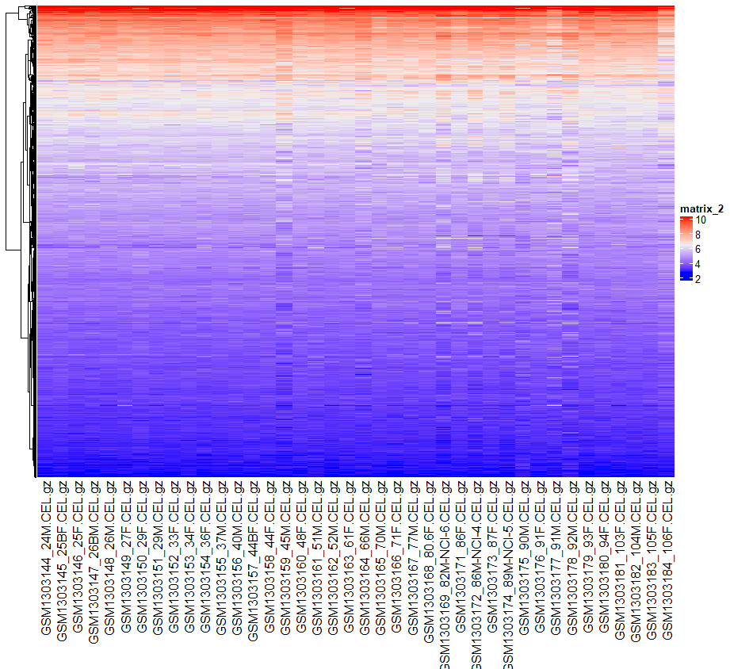

```{r, include = FALSE}
knitr::opts_chunk$set(
  collapse = TRUE,
  comment = "#>"
)
```


## Introduction
This R notebook describes what I have done to process GEO dataset GSE53890 by R packages. GSE53890 is a microarray data for comparison of the gene expression profiles of adult human brain samples from frontal cortical regions, including samples from young, middle aged, normal aged.


## Details
 
### __*Select an Expression Data Set*__ 
I search for Alzheimer's disease and found  GSE53890 dataset quite interesting and want to process it
The following code shows how to get the supplement files for GSE53890 from GEO and how to process the cel.gz.tar file.
```{}
if(!file.exists('GSE53890/CEL')){
  sfiles = GEOquery::getGEOSuppFiles('GSE53890')
  untar("GSE53890/GSE53890_RAW.tar", exdir = "GSE53890/CEL")
}
```


### __*Clean the data and map to HUGO symbols*__ 
 For microarray data, I use arrayQualityMetrics package in bioconductor to access the outliers in both normalized,by Robust Multi-Array Average (RMA), ExpressionSet and unnormalized AffyBatch. There are 7 outliers  detected in normalized dataset and 15 outliers detected in unnormalized dataset. I only
do the process without cell file 27 because there maybe biological significant behind other outliers and there are many samples for 80s years old so that file 27 as a outlier will cause less misinterpretation and make two gourps young and old same number of samples in two groups. (I want to compare two group one group with 20 samples (>60 year old) and 20 samples(<60 year old)). I map the row Identifier by biomaRt package. 

  
```{}
require("biomaRt")
mart <- useMart("ENSEMBL_MART_ENSEMBL")
mart <- useDataset("hsapiens_gene_ensembl", mart)
annotLookup <- getBM(
  mart = mart,
  attributes = c(
    "affy_hg_u133_plus_2",
    "ensembl_gene_id"),
  filter = "affy_hg_u133_plus_2",
  values = rownames(exprs(eset)),
  uniqueRows=TRUE)


rowname<-rownames(Biobase::exprs(eset))
# better mapping data
require(data.table)
# collapse multigene name for one probe name
new <- setDT(annotLookup)[,.(ensembl_gene_id= paste(ensembl_gene_id, collapse = " |")), by=affy_hg_u133_plus_2]
# elimate NaN during mapping with original probename
mylist<- c()
for (p in rowname) {
  geneId <- new[affy_hg_u133_plus_2 == p]$ensembl_gene_id
  if (identical(geneId,character(0))){
    mylist <- c(mylist, p)
  }
  mylist <- c(mylist, geneId)
}
#make rowname unqiue before assign to rowname
indicesLookup <- match(rownames(eset), annotLookup$affy_hg_u95av2)
newname <- paste(
  mylist,
  c(1:length(indicesLookup)),
  sep="_")


#clean array outliers
library("arrayQualityMetrics")
arrayQualityMetrics(expressionset = eset,
                    outdir = "Report_for_rma",
                    force = TRUE,
                    do.logtransform = TRUE)

arrayQualityMetrics(expressionset = affy.data,
                    outdir = "Report_for_affy.data",
                    force = TRUE,
                    do.logtransform = TRUE)


# do the process without cell file 27 because there maybe biological significant behind the outlier and there are many samples for 80s years old so that file 27 maybe a outlier and make two gourps young and old same number of sample 
newf <- f[-27]

newAffyData = ReadAffy(filenames = newf)

```

### __*Apply Normalization*__ 
I compare Affymetrix's MAS 5.0 expression measure(mas5) and RMA for microarray data normalization. The box plot more even by rma and I read some paper about these two normalization methods and I choose to use RMA. The box plot can be viewed below.

```{}
eset.mas5 = mas5(affy.data)
eset <- rma(affy.data)
exprs(eset.mas5) <- log2(exprs(eset.mas5))
boxplot(exprs(eset.mas5),outline=FALSE)
boxplot(exprs(eset),outline=FALSE)
```





### __*Full work flow*__ 
```{}
#a package that make querying the metadata describing microarray experiments,platforms, and datasets easier. Especially for R users.
if (!requireNamespace("BiocManager", quietly = TRUE))    
  install.packages("BiocManager")

list.of.packages <- c("GEOquery", "affy", "limma","biomaRt","arrayQualityMetrics" )
new.packages <- list.of.packages[!(list.of.packages %in% installed.packages()[,"Package"])]
if(length(new.packages)) install.packages(new.packages)
# get data to analysis for alzihemer unzip the data and find cel.gz
if(!file.exists('GSE53890/CEL')){
  sfiles = GEOquery::getGEOSuppFiles('GSE53890')
  untar("GSE53890/GSE53890_RAW.tar", exdir = "GSE53890/CEL")
}


# list cell files in CEL dict
f <- list.files("GSE53890/CEL",full.names = TRUE)

library(affy)   # Affymetrix pre-processing
library(limma)
#read Cel files into AffyBatch and convert AffyBatch into ExpressionSet
affy.data = ReadAffy(filenames = f)
eset.mas5 = mas5(affy.data)
eset <- rma(affy.data)
exprs(eset) <- log2(exprs(eset))
boxplot(exprs(eset.mas5),outline=FALSE)
boxplot(exprs(eset),outline=FALSE)
# compare two normalization methods and find RMA better.

# mapping probe ids by  biomaaRt
require("biomaRt")
mart <- useMart("ENSEMBL_MART_ENSEMBL")
mart <- useDataset("hsapiens_gene_ensembl", mart)
annotLookup <- getBM(
  mart = mart,
  attributes = c(
    "affy_hg_u133_plus_2",
    "ensembl_gene_id"),
  filter = "affy_hg_u133_plus_2",
  values = rownames(exprs(eset)),
  uniqueRows=TRUE)


rowname<-rownames(Biobase::exprs(eset))
# better mapping data
require(data.table)
# collapse multigene name for one probe name
new <- setDT(annotLookup)[,.(ensembl_gene_id= paste(ensembl_gene_id, collapse = " |")), by=affy_hg_u133_plus_2]
# elimate NaN during mapping with original probename
mylist<- c()
for (p in rowname) {
  geneId <- new[affy_hg_u133_plus_2 == p]$ensembl_gene_id
  if (identical(geneId,character(0))){
    mylist <- c(mylist, p)
  }
  mylist <- c(mylist, geneId)
}
#make rowname unqiue before assign to rowname
indicesLookup <- match(rownames(eset), annotLookup$affy_hg_u95av2)
newname <- paste(
  mylist,
  c(1:length(indicesLookup)),
  sep="_")


#clean array outliers
library("arrayQualityMetrics")
arrayQualityMetrics(expressionset = eset,
                    outdir = "Report_for_rma",
                    force = TRUE,
                    do.logtransform = TRUE)

arrayQualityMetrics(expressionset = affy.data,
                    outdir = "Report_for_affy.data",
                    force = TRUE,
                    do.logtransform = TRUE)


# do the process without cell file 27 because there maybe biological significant behind the outlier and there are many samples for 80s years old so that file 27 maybe a outlier and make two gourps young and old same number of sample 
newf <- f[-27]

newAffyData = ReadAffy(filenames = newf)
neweset <- rma(newAffyData)
boxplot(exprs(neweset),outline=FALSE)
neweseetMas5 = mas5(newAffyData)
boxplot(exprs(neweseetMas5),outline=FALSE)
rownames(neweset) <- newname
```
### __*Interpret*__ 

#### What are the control and test conditions of the dataset?

The control conditions is people with age less than 60. The test conditions is people with age mroe than 60.


#### Why is the dataset of interest to you?

I wanted to learn more about brain, especially Alzheimer's disease, so I used GSE53890 as my dataset


#### Were there expression values that were not unique for specific genes? How did you handle these?

There were probe ID for multi regions of same gene. I merge multi-expression values into a row name for not unique one and add ID to make each rowname unqiue. The following codes address the solving steps.

```{}
rowname<-rownames(Biobase::exprs(eset))
# better mapping data
require(data.table)
# collapse multigene name for one probe name
new <- setDT(annotLookup)[,.(ensembl_gene_id= paste(ensembl_gene_id, collapse = " |")), by=affy_hg_u133_plus_2]
# elimate NaN during mapping with original probename
mylist<- c()
for (p in rowname) {
  geneId <- new[affy_hg_u133_plus_2 == p]$ensembl_gene_id
  if (identical(geneId,character(0))){
    mylist <- c(mylist, p)
  }
  mylist <- c(mylist, geneId)
}
#make rowname unqiue before assign to rowname
indicesLookup <- match(rownames(eset), annotLookup$affy_hg_u95av2)
newname <- paste(
  mylist,
  c(1:length(indicesLookup)),
  sep="_")

```


#### Were there expression values that could not be mapped to current HUGO symbols?

The above code solved the problem. I remained the probe ID with no expression value. Because not all probes in microarray target expressive RNA, some may not.   


#### How many outliers were removed?
only one outlier was removed because Some outliers may have biological significants. I only remove one because only file 27 is considered outlier for 80s. This may be caused by experimental error. As a result I removed this group. The removal of this group can also make control group and testing group have even comparsion sample groups. 


#### How did you handle replicates?
for replicate probe IDs, I turn them into expression value with subnumber labeled. I didn't merege any replicates or delete them.


#### What is the final coverage of your dataset?
The dataset covers brain RNA data from all adulthood age from 20s to 100s. 

## References

*  Mapping identifiers for the integration of genomic datasets with the R/Bioconductor package biomaRt. Steffen Durinck, Paul T. Spellman,
  Ewan Birney and Wolfgang Huber, *Nature Protocols 4*, 1184-1191 (2009).
  
*  BioMart and Bioconductor: a powerful link between biological databases and microarray data analysis. Steffen Durinck, Yves Moreau, Arek
  Kasprzyk, Sean Davis, Bart De Moor, Alvis Brazma and Wolfgang Huber, *Bioinformatics 21*, 3439-3440 (2005).

*  Kauffmann, A., Gentleman, R.,, Huber, W. (2009) arrayQualityMetrics--a bioconductor package for quality assessment of microarray data.
  *Bioinformatics*, 25(3):415-6.

* Ritchie, M.E., Phipson, B., Wu, D., Hu, Y., Law, C.W., Shi, W., and Smyth, G.K. (2015). limma powers differential expression analyses for
  RNA-sequencing and microarray studies. *Nucleic Acids Research 43(7)*, e47.
  
*  Gautier, L., Cope, L., Bolstad, B. M., and Irizarry, R. A. 2004. affy---analysis of Affymetrix GeneChip data at the probe level.
  *Bioinformatics 20*, 3 (Feb. 2004), 307-315.
  
*  Davis, S. and Meltzer, P. S. GEOquery: a bridge between the Gene Expression Omnibus (GEO) and BioConductor. *Bioinformatics*, 2007, 14,
  1846-1847

* Parnell LD, Lindenbaum P, Shameer K, Dall'Olio GM, Swan DC, et al. (2011) BioStar: An Online Question & Answer Resource for the Bioinformatics Community. *PLoS Comput Biol 7(10)*: e1002216.

* Rafael A. Irizarry, Benjamin M. Bolstad, Francois Collin, Leslie M. Cope, Bridget Hobbs, Terence P. Speed, Summaries of Affymetrix GeneChip probe level data, *Nucleic Acids Research*, Volume 31, Issue 4, 15 February 2003, Page e15,


----

```{r}
sessionInfo()
```
